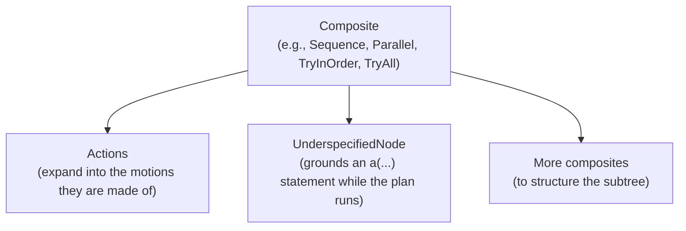

(plan_header)=

# The CoraPlex Plan

```{contents}
:local:
:depth: 1
```

## What is a Plan?

A plan is the statechart node that describes what a robot does. It is usually a cramph composite, such as `Sequence`,
`Parallel`, `TryInOrder` or `TryAll`, holding actions, motions and further composites. A plan is built on its own,
independently of the world and robot it will run with:

```python
from cramph.composites import Sequence

plan = Sequence([ParkArmsAction(robot.all_arms), NavigateAction(target_pose)])
```

## How a Plan is shaped

A plan is a tree with a composite at the root and actions beneath it:



- Composites define the order and concurrency of their children, and how a failing child affects them.
- Actions expand into the motions they are made of once they join a statechart.
- An `UnderspecifiedNode` holds an `a(...)` statement, which is grounded into a concrete action against the world as
  the steps before it left it, each candidate being tried on a copy of the world first.

## Executing a Plan

A `PlanExecutor` compiles a plan and executes it, the way a Giskard executor compiles and executes a motion
statechart:

```python
from coraplex.plans.plan_execution import PlanExecutor

executor = PlanExecutor(context)
with simulated_robot:
    executor.compile(plan)
    executor.execute()
```

- `compile` builds one statechart holding the plan, the collision avoidance when the execution environment asks for
  it, and an `EndMotion` that ends the statechart once the plan succeeded.
- `execute` runs that statechart in simulation, or sends it to Giskard on the real robot, and raises
  `MotionDidNotFinish` if the plan did not succeed.
- The context passed to the executor carries the world, the robot and the settings every node of the plan runs with.

## Inspecting a Plan

Every node of an executed plan keeps its life cycle state, start and end, so the plan itself is the record of what
the robot did. Its statechart can be drawn with `plan.statechart.visualize()`, and an executed plan can be stored in
a database through ORMatic like any other node.
