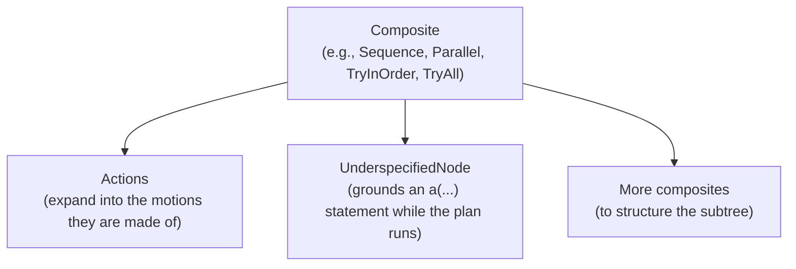

(plan_header)=

# The CoraPlex Plan

```{contents}
:local:
:depth: 1
```

## What is a Plan?

A plan is what a robot does: the nodes at the top level of a statechart. They are usually cramph composites, such as
`Sequence`, `Parallel`, `TryInOrder` or `TryAll`, holding actions, motions and further composites. A plan's nodes are
built on their own, independently of the world and robot they will run with:

```python
from cramph.composites import Sequence

plan = Sequence([ParkArmsAction(robot.all_arms), NavigateAction(target_pose)])
```

## How a Plan is shaped

Each top-level node of a plan is a tree with a composite at the top and actions beneath it:



- Composites define the order and concurrency of their children, and how a failing child affects them.
- Actions expand into the motions they are made of once they join a statechart.
- An `UnderspecifiedNode` holds an `a(...)` statement, which is grounded into a concrete action against the world as
  the steps before it left it, each candidate being tried on a copy of the world first.

## Executing a Plan

An executor builds the statechart context a plan runs in, out of the world and the context extensions it is given,
and compiles and executes the statechart holding the plan, the way a Giskard executor compiles and executes a motion
statechart:

```python
from coraplex.plans.context_extensions import RobotAccess
from coraplex.plans.executors import SimulatedPlanExecutor
from cramph.statechart import Statechart

executor = SimulatedPlanExecutor(world, context_extensions=[RobotAccess(robot)])
statechart = Statechart(context=executor.context)
statechart.add_node(plan)
executor.compile(statechart)
executor.execute()
```

- The context extensions carry what every node of the plan reads from its context, such as the robot performing it
  (`RobotAccess`) and how its statements are grounded (`StatementGrounding`).
- `compile` adds to the statechart the collision avoidance when the executor is asked for it, and an `EndMotion` that
  ends the statechart once every top-level node of the plan succeeded.
- `execute` runs that statechart: a `SimulatedPlanExecutor` in simulation, a `RobotPlanExecutor` by sending it to
  Giskard on the real robot. It raises `MotionDidNotFinish` if the plan did not succeed.
- An executor runs one statechart, so every plan gets an executor of its own.

## Inspecting a Plan

Every node of an executed plan keeps its life cycle state, start and end, so the plan itself is the record of what
the robot did. Its statechart can be drawn with `plan.statechart.visualize()`, and an executed plan can be stored in
a database through ORMatic like any other node.
